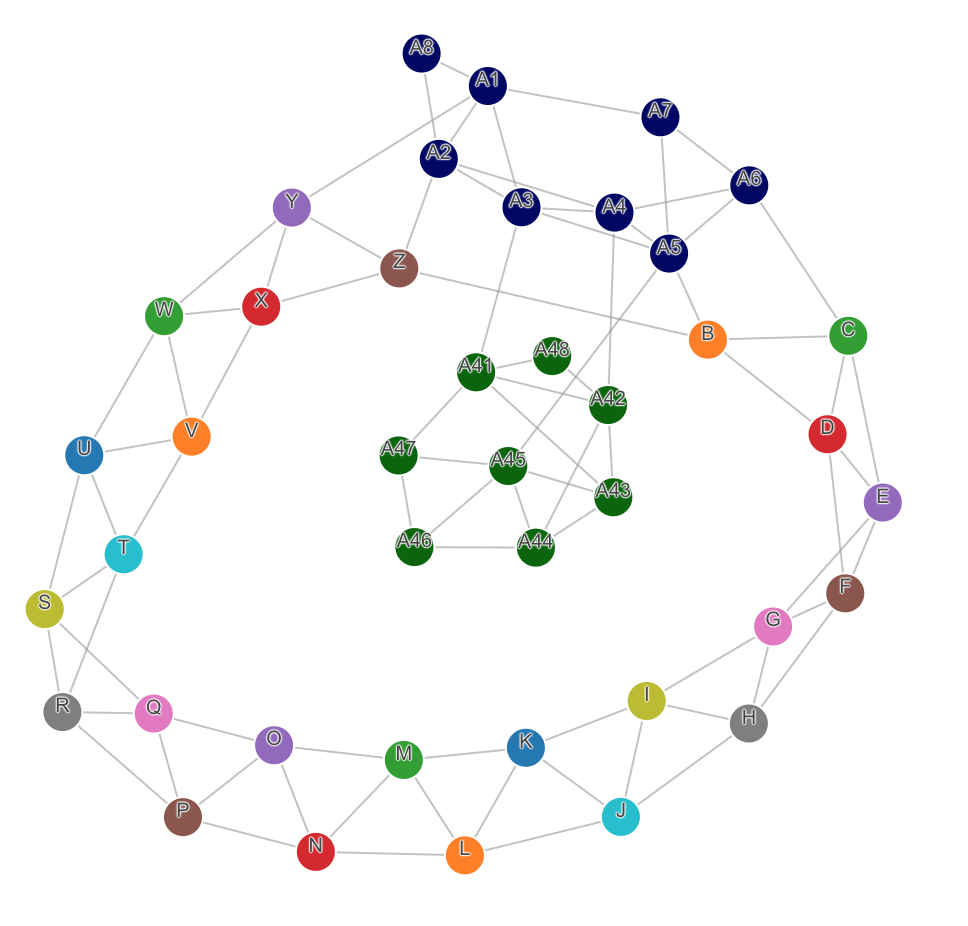
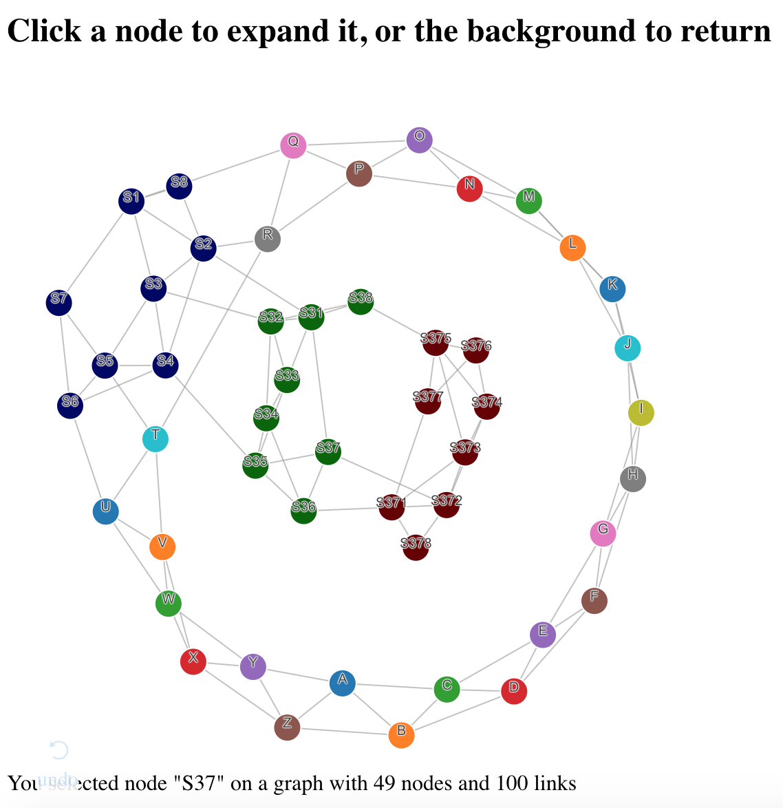

# Dash D3 Network Graph

Seee LEARNINGS.md!! 



This repository demonstrates the principles of combining D3 with React, using a D3 force-layout network graph as an example, and was created from the [`dash-component-boilerplate` template](https://github.com/plotly/dash-component-boilerplate). This component allows dynamically changing the nodes and links and their properties, and responding to clicks on individual nodes.

To run the Dash demo:
1. Clone this repo
2. Run the demo app
```
python usage.py
```
3. Open your web browser to http://localhost:8050

# Code walkthrough - JavaScript side

Following the structure laid out in the [D3 + React tutorial](https://gist.github.com/alexcjohnson/a4b714eee8afd2123ee00cb5b3278a5f) we make two files: [`d3/network.js`](src/lib/d3/network.js) for the D3 component and [`components/Network.react.js`](src/lib/components/Network.react.js) for its React/Dash wrapper. Following the `dash-component-boilerplate` example, this component is then exported using [`index.js`](src/lib/index.js) which is imported by the main component in [`App.js`](src/demo/App.js).

## Network.react.js and App.js

If you saw the first demo in this D3+React series, the [sunburst diagram](https://github.com/plotly/dash-sunburst), these files will look awfully familiar. In fact, the only changes are different `props` that we pass through to the D3 component. As a developer familiar with D3 this is quite convenient: the React wrapper is extremely thin and agnostic to the D3 code it encapsulates.

## network.js

This file too is quite similar to its Sunburst analog. The constructor does the same three tasks: create container DOM elements, set up some D3 helpers, and run the initial update. It contains exactly the same diffing helper, which it uses to determine the minimal update pathway.

`NetworkD3` is a bit simpler than `SunburstD3` because D3's force layout animations are more fluid than the prescheduled `selection.transition()` as used by sunburst. The force simulation can adapt to new, removed, and changed nodes at any time. That means we don't need to wait for transitions to finish before updating the figure data.

The key to making this work is starting with empty node and link arrays (`self.nodeData` and `self.linkData`) and updating them in-place when new data arrives, taking care to preserve extra attributes (`x`, `y`, `vx`, `vy`, `fx`, `fy`) added by the force simulation on the nodes it has already seen. This happens in the `if(dataChange)` block of `self.update`:
```js
// Update nodes with new data.
// The force simulation is connected to the self.nodeData array
// and it adds other attributes to the array, so update this array in place
const nodeMap = {};
const newIDs = {};
for(i in self.nodeData) {
    nodeMap[self.nodeData[i].id] = self.nodeData[i];
}
for(i in data.nodes) {
    const newNode = data.nodes[i];
    newIDs[newNode.id] = 1;
    const existingNode = nodeMap[newNode.id];
    if(existingNode) {
        existingNode.radius = newNode.radius;
        existingNode.color = newNode.color;
    }
    else {
        self.nodeData.push(newNode);
        nodeMap[newNode.id] = newNode;
    }
}
for(i = self.nodeData.length - 1; i >= 0; i--) {
    const oldId = self.nodeData[i].id;
    if(!newIDs[oldId]) {
        self.nodeData.splice(i, 1);
        delete nodeMap[oldId];
    }
}
self.simulation.nodes(self.nodeData);

// Update links in place as well
// Links array has no extra data so we can simply replace old with new
// but convert ids to node references
for(i in data.links) {
    const linkDatai = data.links[i];
    self.linkData[i] = {
        source: nodeMap[linkDatai.source],
        target: nodeMap[linkDatai.target],
        index: i
    };
}
const oldLinkCount = self.linkData.length;
const newLinkCount = data.links.length;
if(oldLinkCount > newLinkCount) {
    self.linkData.splice(newLinkCount, oldLinkCount - newLinkCount);
}
```
The rest is standard D3 code, with large chunks ported from Mike Bostock's [d3-force-directed-graph](https://beta.observablehq.com/@mbostock/d3-force-directed-graph) example. (Note that `NetworkD3` uses the latest D3V5, unlike `SunburstD3` which uses D3V3).

To run the JavaScript-only demo, which shows updating the network while displaying information about the node you clicked on:
```
npm run start
```

# Code Walkthrough - Python side

Because we used `dash-component-boilerplate`, we can run:
```
npm run build:all
```
to prepare the component for Python usage.

The example app [`usage.py`](usage.py) uses clicking on a node to fetch sub-node data from the server (recursively, if you then click on one of those sub-nodes) and update the graph, while displaying some simple statistics about the graph. Most of the logic is in the function `net_data` the calculates the network for a given selection. I won't go into detail there, as that's just a mock of real domain logic. The app code that ties it together is straightforward:

```py
app.layout = html.Div([
    html.H2('Click a node to expand it, or the background to return'),
    Network(
        id='net',
        data=net_data('')
    ),
    html.Div(id='output')
])

@app.callback(Output('net', 'data'),
              [Input('net', 'selectedId')])
def update_data(selected_id):
    return net_data(selected_id)

@app.callback(Output('output', 'children'),
              [Input('net', 'selectedId'), Input('net', 'data')])
def list_connections(selected_id, data):
    return 'You selected node "{}" on a graph with {} nodes and {} links'.format(
        selected_id, len(data['nodes']), len(data['links']))
```



# More Resources
- Learn more about Dash: https://dash.plot.ly
- View the original component boilerplate: https://github.com/plotly/dash-component-boilerplate
